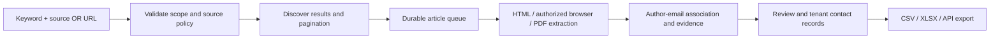

# EmailMonitor

**Academic contact discovery and extraction for multiple organizations.**

A user enters a keyword and a publisher/source, or pastes a search-results, article, or PDF URL. EmailMonitor discovers the eligible articles, follows pagination, opens article pages and permitted full text, and returns author names, author roles, professional email addresses, affiliations, and evidence.

> **Status: design baseline v0.1 — 2026-10-08.** This repository contains implementation documentation, proposed contracts, and synthetic fixtures. There is no working application, live connector certification, deployment, or measured extraction benchmark yet. Requirements and targets are not claims of achieved capability.

## Start here

- **Product owner:** [documentation map](docs/README.md), [product charter](docs/00-product-charter.md), [business requirements](docs/01-business-requirements.md).
- **Codex / implementer:** [AGENTS.md](AGENTS.md), [CODEX_START_HERE.md](CODEX_START_HERE.md), [delivery backlog](docs/16-delivery-backlog.md).
- **Architecture / enterprise review:** [architecture](docs/04-architecture.md), [tenant isolation](docs/05-multitenancy-and-access.md), [security](docs/11-security-and-threat-model.md).
- **Validation:** [acceptance and traceability](docs/17-acceptance-and-traceability.md), [implementation status](docs/22-implementation-status.md).

## Core product



The product handles all **eligible results within an explicit job budget**, not every link on the internet. Unavailable contacts, blocked access, unsupported sources, pagination caps, and ambiguous identities must be reported, not hidden. First author and corresponding author are separate fields. An observed email is not proof that its mailbox is deliverable or that outreach is authorized.

## Product boundaries

**Core release:** organizations, role-based access, source onboarding, keyword and URL jobs, scoped discovery, HTML/PDF extraction, browser interactions where authorized, provenance, review, deduplication, resumable processing, exports, usage controls, and audit.

**Later:** recurring discovery, optional wider-web identity enrichment, outreach campaigns, mailbox connections, reply classification, manuscript intake, and editorial integrations. The core does not depend on Jev or any other external AI provider. No emails are sent by the extraction MVP.

**Not supported:** defeating authentication, paywalls, CAPTCHAs or access controls; mailbox/IP rotation to evade restrictions; guessing and presenting emails as observed facts; unrestricted third-party scripts; cross-customer sharing of contact data.

## Multi-organization design

One codebase supports a hosted multi-tenant deployment and dedicated customer deployments. Tenant isolation is required from the first persistent data implementation, including database rows, workers, storage, exports, secrets, logs, and support access. Branding and quotas are configuration, not customer-specific forks.

## Development entry point

The first implementation slice is **EM-001: repository scaffold and offline fixture harness**. Then build identity/tenancy and network controls before live crawling. See the ready-to-use prompt in [CODEX_START_HERE.md](CODEX_START_HERE.md).

The documentation check is available now:

```sh
python scripts/validate_docs.py
```

Application commands will be introduced and tested by EM-001; none are implied by this README.

## Public repository and licensing

This repository was public when inspected on 2026-10-08. Its visibility has not been changed. Do not commit credentials, customer data, actual contact lists, licensed full text, or production exports. Synthetic examples use reserved example domains. See [NOTICE.md](NOTICE.md), [SECURITY.md](SECURITY.md), and the [dependency/licensing decision](docs/adr/0005-ai-and-dependency-licensing.md).

No open-source or customer commercial license is selected by this documentation pack. Decide the legal license and confidentiality model before distributing implementation code.
