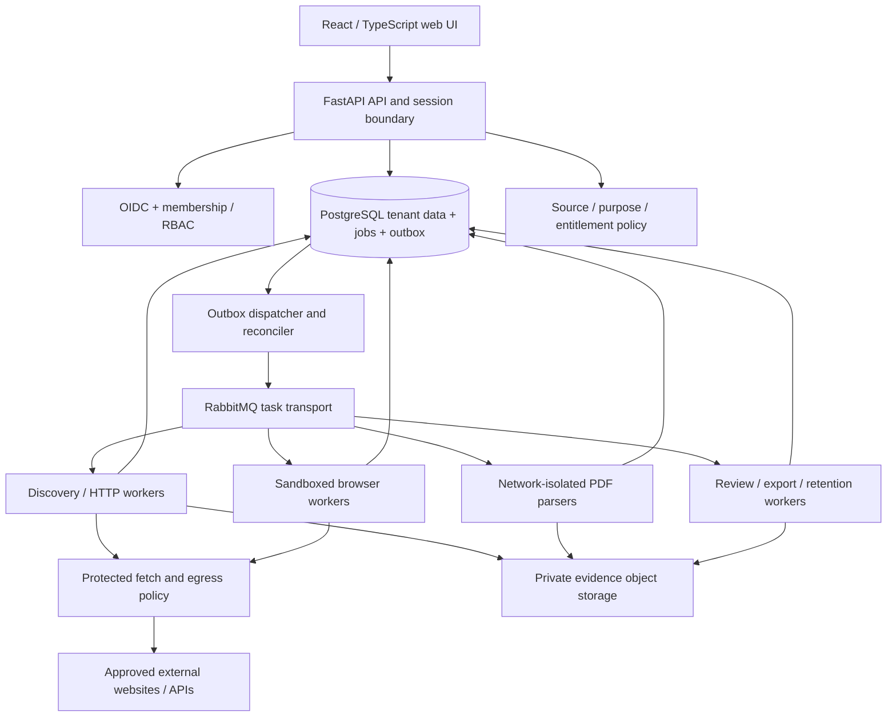

# 04 — Technical architecture

**Baseline:** 2026-10-08. **Decision:** modular monolith with separate resource-isolated worker processes; one tenant-aware codebase for hosted and private deployments.

## Logical components



## Module boundaries

Identity/organizations; source registry and policies; planning; discovery frontier; fetching; parsing; identity association; contact catalog; review; exports; usage/entitlements; audit; lifecycle/deletion; future integrations. Domain services contain rules; API and workers call the same services. Adapters do not own authorization or billing.

The network gateway is a security boundary, not merely a Python helper that a connector can bypass. Isolate browser/fetch pods or processes behind enforced outbound network rules. PDF parsers receive bytes/object references, no internet access or API/database credentials beyond narrowly scoped work access. A compromised browser must not reach the API, database, broker, metadata endpoint or other customers' storage.

## Stack baseline

| Layer | Choice | Notes |
|---|---|---|
| Backend | Python, FastAPI, Pydantic, SQLAlchemy, Alembic | One package with module boundaries; verify compatible stable versions in EM-001 |
| Web | React, TypeScript, Vite; pnpm | SPA and API behind same origin; avoid a second business-logic backend |
| Identity | Standards-based OIDC, backend session | Use a supported identity provider; no homemade password/auth platform |
| Durable state | PostgreSQL | Tenant rows, job ledger, outbox, audit and usage authority |
| Work transport | Celery with RabbitMQ | JSON messages, no pickle; at-least-once semantics and publisher confirmations |
| Static extraction | HTTP client + HTML/XML parsers | All I/O through protected gateway; disable XML external entities |
| Dynamic extraction | Playwright with Chromium | Authorized interactions only; restricted browser contexts and bounded resources |
| PDF | pypdf + pdfplumber candidates | Verify exact releases/dependencies/licenses; isolate parsers |
| OCR | Later optional adapter | Renderer, OCR engine and language-pack licenses reviewed separately |
| Storage | Local development adapter; private S3-compatible production adapter | No public buckets; tenant namespace is not the sole authorization check |
| Telemetry | Structured redacted logs and OpenTelemetry-compatible metrics/traces | No email addresses or page content in metric labels |
| Delivery | OCI containers and Compose for development/pilot | Production infrastructure selected per customer; no Kubernetes requirement |

Do not call the selected versions 'latest' in code or use floating container tags. Record language/runtime compatibility, lockfiles, browser revision and license inventory in EM-001. PyMuPDF is not the default because its dual licensing needs a deliberate commercial decision [S07]. PostgreSQL and Celery behavior must be checked against their official documentation [S01, S02]. References: document 20.

## Planned repository layout

```text
apps/web/                    # UI
services/backend/            # API, domain services, workers, migrations
  src/emailmonitor/
    identity/ organizations/ sources/ policy/
    jobs/ discovery/ fetching/ extraction/ identity_resolution/
    contacts/ reviews/ exports/ usage/ audit/ lifecycle/
    adapters/ api/ workers/
contracts/                   # API/event/schema proposals and examples
fixtures/                    # synthetic offline inputs
infra/                       # deployment templates added during implementation
scripts/                     # checks and development helpers
tests/                       # unit, integration, security, connector, e2e
```

This is a target layout; directories not yet present are not implemented. Avoid empty modules pretending to be complete services.

## Request and data flow

A user session establishes identity; backend validates organization membership and capability. Job request is schema-validated and persisted. Preflight evaluates source policy and caps. Start reserves quota and commits a job/outbox entry in one transaction. Dispatcher publishes minimal signed/internal work references. Worker validates job ownership, status, policy and lease, then performs only its permitted stage. Results and outbox successors commit together. UI reads durable state; a lost event stream never loses results.

Tenant and resource IDs arrive from both session and request, but authority comes from server membership and database lookup. Events contain IDs, counters and reason codes, not researcher emails or full documents. Queue messages are untrusted if tampered with; workers resolve authoritative context rather than executing supplied URLs blindly.

## Deployment modes

Hosted: several organizations in one regional deployment cell, RLS plus application authorization and isolated object/secret access. Scale horizontally by worker class and partition tenants into cells when measured capacity requires it.

Dedicated: one customer's organization(s), separate database/broker/storage/key material and customer-approved egress. Same schema and RLS remain enabled. Application self-hosting does not mean the web can be crawled offline; extraction still needs approved external source access. External AI stays disabled unless explicitly configured.

No cross-deployment tenant migration, cross-customer contacts, shared source credentials or unified researcher identity graph is automatic. Export/import migration is an audited future operation.

## Simplifications and trade-offs

No Kafka, vector database, knowledge graph database, multi-region active-active, Kubernetes operator, billing payment gateway or AI agent planner in the first release. PostgreSQL handles search/filtering and job authority. RabbitMQ carries work only; its loss is recoverable from the outbox/job ledger. Object storage holds minimal retained evidence, not an uncontrolled archive of publisher PDFs.

## Extension points

SourceConnector, ProtectedFetcher, DocumentParser, IdentityResolver, StoragePort, IdentityProvider, EntitlementProvider and optional DecisionProvider. Interfaces are vendor-neutral; server-side registries allow approved implementations only. Tenant configuration cannot upload executable Python or JavaScript.
