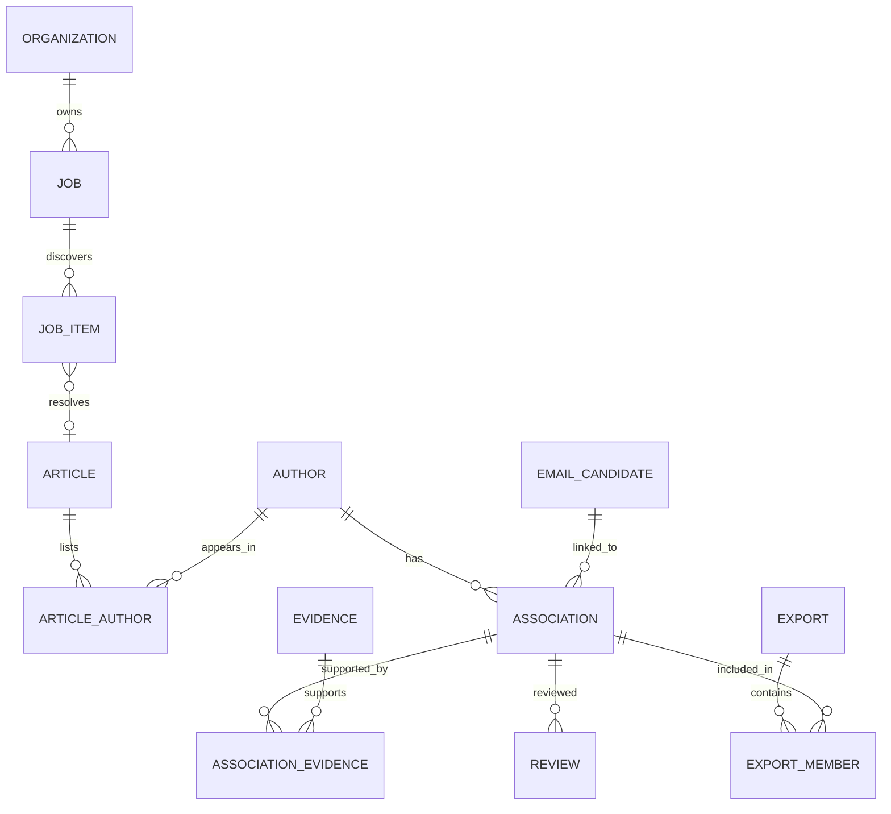

# 08 — Data model and integrity rules

**Baseline:** 2026-10-08. This is a logical/schema design, not executable migrations. EM-002/EM-005/EM-009 translate it into reviewed migrations and tests.

## Conventions

Use UUID primary identifiers, UTC timestamps, explicit enums, optimistic `row_version`, and `organization_id` on all tenant business tables. Tenant tables use composite primary or unique keys `(organization_id, id)` and composite foreign keys. Never permit a job in organization A to reference B's source policy, author, evidence, contact, review or export. Runtime reads/writes require RLS and service authorization.

Store provenance observations separately from consolidated records. Null means unknown/not available; empty arrays mean observed absence only when the parser can support that conclusion. Retain Unicode originals; normalized values are separate indexed fields. JSON is appropriate for connector checkpoints or metadata extensions, not as a replacement for all relational integrity.

## Entity catalog

| Entity | Key fields and purpose |
|---|---|
| organizations | id, display/legal name, status, region, timezone, plan_ref, settings_revision, deletion_generation |
| identities | id, OIDC issuer+subject, minimal user profile; no implicit cross-tenant permission |
| memberships | organization_id, identity_id, role, capability_grants, status; unique membership |
| source_catalog | platform source key, connector/version, capabilities, supported host relationships; no customer credentials |
| source_policies | organization_id, source_id, version, state, purpose, allowed routes/hosts, permission_ref, approval/expiry, limits, retention/export rules |
| source_credentials | organization_id, source_id, secret_reference, scope, status, rotation metadata; never plaintext secret |
| jobs | organization_id, id, input, source_id, policy_snapshot_id, state, discovery_complete, stop_reasons, limits, author_target, created_by, generation |
| discovery_pages | organization_id, job_id, checkpoint_key, response_digest, cursor/next state, reported_total, parsed_count, terminal_reason |
| job_items | organization_id, job_id, id, canonical_url, article_id nullable, state, stage, lease_token, lease_expiry, attempt_count, reason, generation |
| articles | organization_id, id, DOI nullable, title, journal, date/value/type, canonical_source_url, metadata_revision |
| article_observations | organization_id, article_id, source_id, observed metadata, evidence_id, observed_at |
| authors | organization_id, id, display_name, ORCID nullable, person/group type, identity_state; no uniqueness by name |
| article_authors | organization_id, article_id, author_id, author_order, first_role, correspondence_role, role_evidence_ids |
| affiliations | organization_id, id, institution_name, optional explicit ROR/country, source observation date |
| author_affiliations | organization_id, author_id, affiliation_id, article_id nullable, observed_at, historical/current/unknown |
| email_candidates | organization_id, id, raw_address, normalized_address, comparison_key, syntax_status, domain_status, delivery_status |
| evidence | organization_id, id, article_id, source_id, URLs, method, excerpt/locator, content_digest, object_ref nullable, observed_at, versions, expires_at |
| author_email_associations | organization_id, id, author_id, email_candidate_id, article_id, state, evidence_strength, heuristic_score nullable, calibration nullable, reasons, revision |
| association_evidence | organization_id, association_id, evidence_id; many-to-many evidence links |
| reviews | organization_id, id, association_id, actor, previous/new state, reason, evidence_ids, expected_revision, created_at |
| suppressions | organization_id, id, keyed contact digest, scope, reason, authority, created_at, expires_at nullable |
| exports | organization_id, id, requested_by, filter_snapshot, purpose, format, state, policy/data_revision, artifact_ref, expires_at, revoked_at |
| export_members | organization_id, export_id, association_id, association_revision; enables invalidation after suppression/deletion |
| usage_reservations | organization_id, job_id, unit_type, reserved, consumed, released, version |
| usage_events | organization_id, unique effect_key, job/item reference, unit_type, quantity, created_at; append-only ledger |
| outbox_events | organization_id, event_id, aggregate_id, event_type, version, payload_ids, published_at, retry state |
| audit_events | organization_id, id, actor, action, resource IDs, reason, request_id, timestamp; minimal non-content payload |
| deletion_requests | organization_id, id, scope, authority, generation, state, requested_at, due_at, completion/evidence report |
| support_grants | organization_id, platform_actor, exact scope, approving owner, reason, expiry, revoked_at |

Infrastructure tables such as deployment-wide source throttles and connector versions are separate from tenant business data. Their access is narrowly controlled and they contain no contact payloads.

## Relationships

Every relationship above is also constrained by organization, even where the diagram omits the column for readability.

## Required uniqueness and indexing

Unique `(organization_id, job_id, canonical_url_key)` on job items; `(organization_id, job_id, checkpoint_key)` on discovery pages; `(organization_id, effect_key)` on usage; `(organization_id, event_id)` on outbox. Article DOI uniqueness is tenant-local only where normalized DOI is non-null; preserve multiple source/version observations.

Do not globally unique an author name, email-to-person association, or corresponding-author position. Index tenant plus creation time/state for jobs/reviews/exports, tenant plus DOI/title for articles, and tenant plus email comparison key for candidate lookup. Avoid leaking global existence through errors. Partitioning is a measured scale optimization, not an initial requirement.

## Transaction boundaries

Job creation/start, policy snapshot and quota reservation commit with the outbox event. Worker finalization commits parsed observations, association candidates, item transition, usage effects and successor events together. An optimistic version/fencing token rejects a stale worker writing after another attempt, cancellation, policy revocation or deletion generation change.

Review updates require `expected_revision`; return conflict on concurrent changes. Export membership is a snapshot but download policy is current. Deletion invalidates related exports rather than serving stale files.

## Deduplication and freshness

Job URL dedup prevents repeated processing in the same enumeration. Tenant article dedup links new observations to existing articles. Candidate-address dedup retains distinct evidence and author relationships. Never collapse ambiguous same-name authors. Refresh produces a new observation with its own timestamp; it does not claim an old email is still live.

## Retention and deletion

Mark data unavailable and increment generation before asynchronous erasure. Cancel related work and revoke artifacts. Purge rows, objects, temporary downloads and cached projections in dependency order; preserve only minimal legally justified audit/suppression material under a separate policy. Keyed email digests are pseudonymous, not automatically anonymous. Backup retention is time-bounded; restoration must reapply tombstones before access is enabled.

Deletion completion reports distinguish live-store removal, queued object cleanup, retained legal-hold exceptions, and backup expiry. Never claim instant deletion from every backup. Exact tenant defaults and contract-specific overrides are in document 21.
